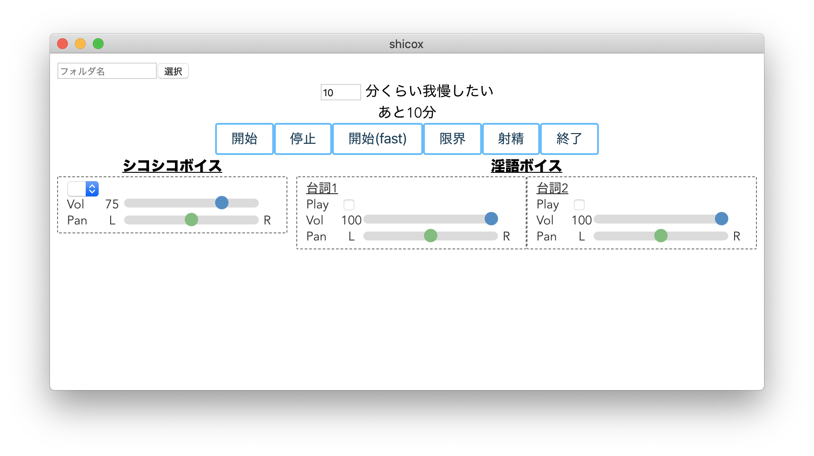

# ShicoX

シコリーダー!を参考にElectronで実装しました。
Windows、Mac、Linuxのプラットフォームで動作するものを目指しています。

同人作品などを売っているサイトなどで"シコリーダー"と検索すると色々出てきます。

本家[シコリーダー!](http://tamemaru.x.fc2.com/sozai.html)とは無関係のプロジェクトです。

## ダウンロード
リリースされたものは[releases](https://github.com/kurorinchan/ShicoX/releases)から
* Windows: .exe
* macOS: .zip
* Linux: .AppImage

### 注意点
* macOS版は解答後に出てきたアプリケーションは[ctrl + クリックしないと起動できません](https://support.apple.com/ja-jp/guide/mac-help/mh40616/mac)。
* Windows版はインストーラのようなアイコンをしていますが、そのまま起動できます。

## 使い方
### 概略
1. リソース（shiko01, voice01, shiko02, voice02, ...) があるフォルダを左上のボタンから選択。
2. 時間を設定。
3. 開始ボタンを押す。

### 基本


1. 左上の選択を押すとフォルダ選択ダイアログがでるのでリソースの入っているフォルダを選択する。
   * リソースフォルダ: shiko01, voice01などがあるフォルダ。
   * 例：C:\resources\shiko01とC:\resources\voice01とある場合、C:\resourcesを選択。
   * 直接フォルダパスを左上のテキストボックスに入力してEnterを押しても同じ動作をする。
2. リソースのロードが終わるとシコシコボイスのトラックが選べたり台詞のチェックボックス変更することができます。
3. \[開始\]または\[開始(fast)\]を押す。

### 各音声操作
`Vol`のスライダーを変えることで音量を0から100まで調整できます。音量が変わると左の数字も変わります。

`Pan`のスライダーを変えることで左や右に寄せたりできます。初期値は真ん中です。
スライダー調整中は真ん中に戻りやすいように（スナップするように）なっています。

#### シコシコボイス
シコシコボイスは複数同時再生（は現状）できません。ドロップダウンメニューで再生したいボイス集
を選択してください。

### ボタンの説明
一部本家のフローチャートで使われている用語を使うのでわからない場合はそちらを参照。あまり差はないです。

* 開始
  * 開始ボイス再生後、設定した時間分台詞ボイスを再生します。
* 停止
  * 現在再生中の音声をすべて停止し、初期状態に戻します。
* 開始(fast)
  * 時間設定に関係なくスパート台詞まで飛ばします。
* 限界
  * 設定時間が終了する前に押すことでスパート開始ボイスに移行します。
  * 台詞ボイス再生時以外は何も起きません。
* 射精
  * 設定時間前に押すと暴発ボイス集に移行します。
  * スパート台詞再生時に押すと射精ボイスを再生します。
  * 台詞ボイスまはたスパート台詞再生時以外は何も起きません。
* 終了
  * 終了ボイスを再生後、プログラムを終了します。

### 詳細
本家のほうで配布されているフローチャートがあるので、それを参考にステートマシンを組んでます。
全遷移を書いている図ではないので、ところどころ受け付ける入力や遷移前の同期などは独自に補完しています。
そのうち[Design Document](#design-document)に詳細を書きます。

## 問題をみつけたら
[Issues](https://github.com/kurorinchan/ShicoX/issues)から問題を説明したIssueを作ってください。日本語でも英語でも対応します。新機能実装も同じ手順で。

## TODO
- [ ] 終了ボタンの実装
- [ ] "○分くらい我慢したい"と"あと○分"を分離
- [ ] 最前面に固定チェックボックス(always on top)
- [ ] アイコン

### 未定
実装するかわからない、仕様を決めづらい機能
- [ ] 前回選択したフォルダパスを記録して起動時に読み込む
- [ ] 画像表示
- [ ] キーボードショートカット（ウィンドウフォーカスがある場合）
- [ ] グローバルキーボードショートカット（ウィンドウフォーカスがない場合）
- [ ] 再生中の音声ファイル名の表示
- [ ] `howler.js`などを使って、より遊べるように（より３次元的など）

# Techincal Details
技術的なことはすべて英語です。

## Design Document
(Link to Google Docs or added in docs/ once its brushed up.)

## LICENSE
See LICENSE

## Project setup

Make sure you have `npm` installed. You may have to install the latest
versions of `npm` and `nodejs`.

Globally install yarn
```
npm install -g yarn
```

Once you have installed `yarn`, run the following command in the root of the
checkout

```
yarn install
```

### Compiles and builds the app for production

```
yarn electron:build
```

### Compiles and hot-reloads with electron

```
yarn electron:serve
```

### Compiles and hot-reloads for development

```
yarn serve
```

### Compiles and minifies for production

```
yarn build
```

### Lints and fixes files

```
yarn lint
```

### Customize configuration

See [Configuration Reference](https://cli.vuejs.org/config/).

## Testing

Run `./node_modules/.bin/_mocha`

If using VSCode, installing
[mocha sidebar](https://marketplace.visualstudio.com/items?itemName=maty.vscode-mocha-sidebar)
helps a lot.
Also adding something like the following to `launch.json` allows you 
to run tests in the debugger.

```json
{
  "type": "node",
  "request": "launch",
  "name": "Mocha Tests",
  "program": "${workspaceFolder}/node_modules/mocha/bin/_mocha",
  "args": [
    "-u",
    "bdd",
    "--timeout",
    "999999",
    "--colors",
    "${workspaceFolder}/test"
  ],
  "internalConsoleOptions": "openOnSessionStart",
  "skipFiles": ["<node_internals>/**"]
},
{
  "type": "node",
  "request": "launch",
  "name": "Mocha Current File",
  "program": "${workspaceFolder}/node_modules/mocha/bin/_mocha",
  "args": ["-u", "bdd", "--timeout", "999999", "--colors", "${file}"],
  "console": "integratedTerminal",
  "internalConsoleOptions": "neverOpen"
}
```
